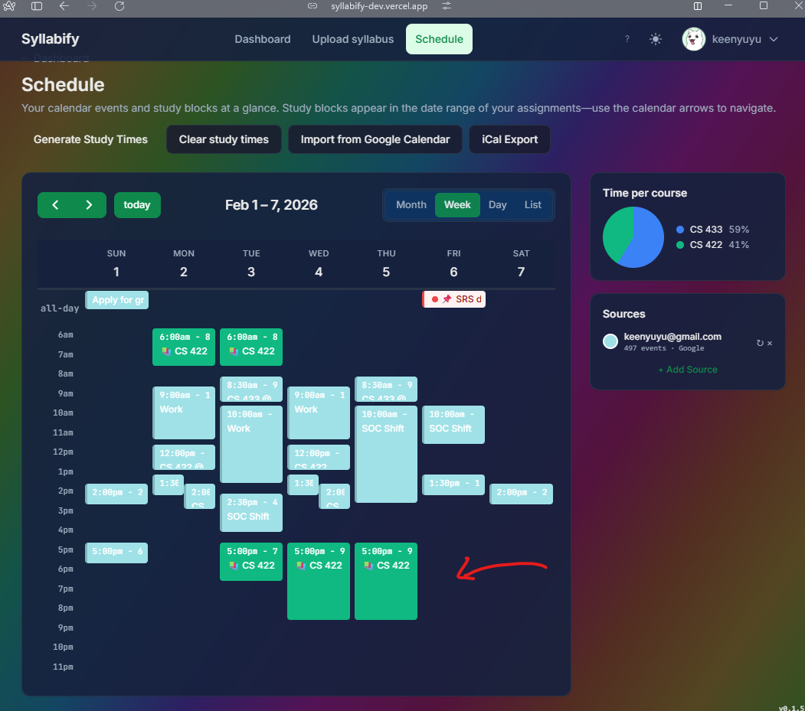

# Syllabify

> Turn syllabi into a balanced study plan — automatically.

**Live demo:** <!-- TODO: add deployed URL here, e.g. https://syllabify.onrender.com -->

Syllabify is a web app for university students. Upload a course syllabus (PDF or text), review the extracted assignments and deadlines, and get a conflict-aware study schedule generated on a FullCalendar view. Export to Google Calendar or download an ICS file.

---

## Screenshots

> Drop your screenshots into `docs/screenshots/` and they'll appear here automatically once added.

### Homepage

<!-- TODO: replace with actual screenshot -->
<!--  -->

```
docs/screenshots/homepage.png
  → The landing page with the hero section and "How it works" steps.
```

### Dashboard

<!-- TODO: replace with actual screenshot -->
<!--  -->

```
docs/screenshots/dashboard.png
  → Dashboard showing course cards and upcoming deadlines countdown.
```

### Syllabus Upload & Review

<!-- TODO: replace with actual screenshot -->
<!--  -->
<!--  -->

```
docs/screenshots/upload-step1.png  → File drop zone / paste text input.
docs/screenshots/upload-step2.png  → Parsed assignment table with editable rows.
```

### Schedule Calendar

<!-- TODO: replace with actual screenshot -->
<!--  -->

```
docs/screenshots/schedule-calendar.png
  → Full week view with color-coded study blocks per course.
  → Show a term with 3–4 courses so the pie chart in the sidebar is visible.
```

### Course Page

<!-- TODO: replace with actual screenshot -->
<!--  -->

```
docs/screenshots/course-page.png
  → Assignment list with completion checkboxes, due dates, and hours.
```

---

## What It Does

1. **Upload** — Drop a PDF or paste syllabus text. An LLM (GPT-5 nano) extracts every assignment, exam, and deadline. Rule-based parsing is available as a fast fallback.
2. **Review** — Edit anything the parser missed: names, due dates, hours, assignment types. Confirm when ready.
3. **Schedule** — A min-cost max-flow algorithm allocates study blocks across your available time, respecting class meetings and imported calendar conflicts.
4. **Export** — Sync to Google Calendar via OAuth or subscribe to a private iCal feed. Drag to reschedule individual blocks; lock blocks you want to keep on regeneration.

---

## Features

- **AI syllabus parsing** — PDF, DOCX, and plain text via GPT-5 nano with rule-based fallback
- **Conflict-aware scheduling** — min-cost max-flow engine respects class times and per-course weekly hour caps
- **Google Calendar OAuth** — import calendars as blocking events and sync your schedule back
- **iCal export** — subscribe with any calendar app (Apple Calendar, Outlook, etc.)
- **Assignment completion tracking** — checkbox per assignment; completed work is excluded from future scheduling
- **Upcoming deadlines** — dashboard card with color-coded days-to-due countdown
- **Dark / light theme** — persistent per-user preference
- **Forgot password flow** — security question setup and token-based reset

---

## Tech Stack

| Layer | Technology |
|-------|------------|
| Frontend | React 18, React Router 6, Tailwind CSS, FullCalendar 6, Vite |
| Backend | Python 3.11, Flask, SQLAlchemy |
| Database | PostgreSQL (Supabase) / MySQL (local dev) |
| AI | OpenAI GPT-5 nano |
| Auth | JWT (7-day expiry), Google OAuth, bcrypt |
| Testing | Vitest + React Testing Library (frontend), pytest (backend) |
| CI/CD | GitHub Actions |
| Deploy | Render (backend), Vercel (frontend) |

---

## Local Development

Requires Docker. No venv or local Python/Node setup needed.

```bash
# 1. Clone and copy env file
git clone https://github.com/your-org/syllabify.git
cd syllabify
cp .env.example .env   # fill in DB creds and OpenAI key

# 2. Start backend + database
docker compose up -d

# 3. Start frontend (separate terminal)
cd frontend
npm install
npm run dev            # http://localhost:3000
```

The backend runs at `http://localhost:5000`. The frontend proxies `/api/*` there automatically.

See `CI-CD-AND-TESTING.md` for running tests and linting inside Docker.

---

## Running Tests

```bash
# Frontend (Vitest)
cd frontend && npm test

# Backend (pytest, inside Docker)
docker compose exec backend pytest
```

---

## Project Structure

```text
syllabify/
├── backend/
│   ├── app/
│   │   ├── api/            # Flask blueprints (auth, courses, schedule, calendar, admin)
│   │   ├── db/             # Connection pooling, SQLAlchemy session, pg_compat layer
│   │   ├── services/       # Business logic (parsing, scheduling, LLM, calendar sync)
│   │   └── main.py         # App factory + blueprint registration
│   └── tests/              # pytest suite (parsing, scheduling, calendar, auth)
│
├── frontend/
│   └── src/
│       ├── api/            # Typed API client (client.js)
│       ├── components/     # Reusable UI (AppCalendar, SyllabusUpload, TermSelector, …)
│       ├── contexts/       # AuthContext, ThemeContext
│       ├── pages/          # Route-level components (Dashboard, Upload, Schedule, Course, …)
│       └── test/           # Vitest component tests
│
├── docs/
│   ├── screenshots/        # App screenshots for README and portfolio
│   ├── bugs/               # Bug postmortems (e.g. Supabase IPv6 on Render)
│   └── architecture/
│
├── docker/
│   └── supabase-schema.sql # Full PostgreSQL schema
│
├── FIXES.md                # Phase-by-phase bug and upgrade log
├── PHASES.md               # Portfolio polish roadmap
├── CI-CD-AND-TESTING.md    # CI setup, local test instructions
├── docker-compose.yml
└── .env.example
```

---

## Development Workflow

- `dev` — active development; all feature branches merge here
- `main` — stable, production-ready; direct pushes blocked; releases via pull request

---

## Project Context

Developed as part of **CS 422 – Software Methodologies I** at the University of Oregon.

**Team:** Andrew Martin · Leon Wong · Saint George Aufranc · Kenny Nguyen
