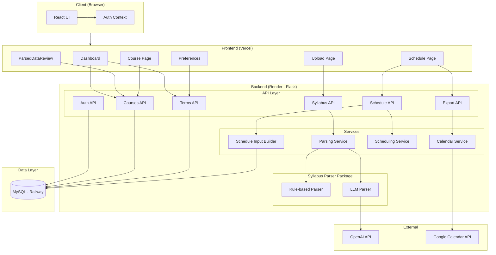
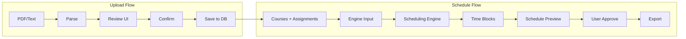
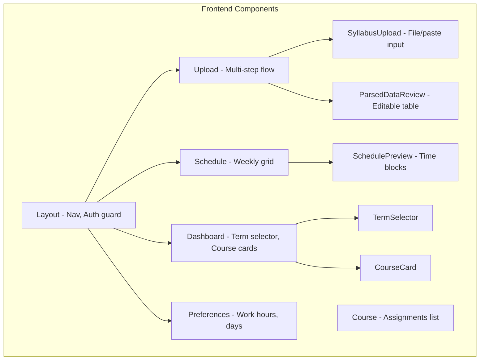
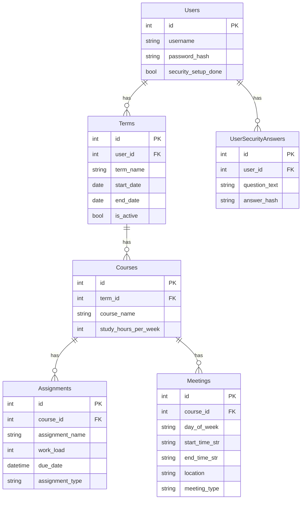
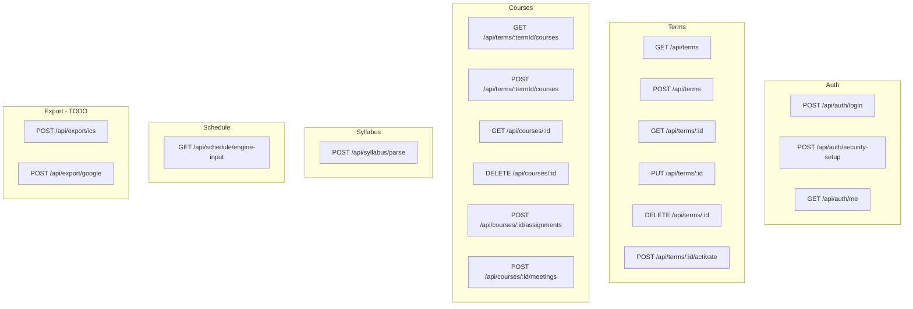
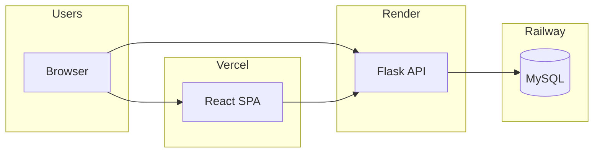
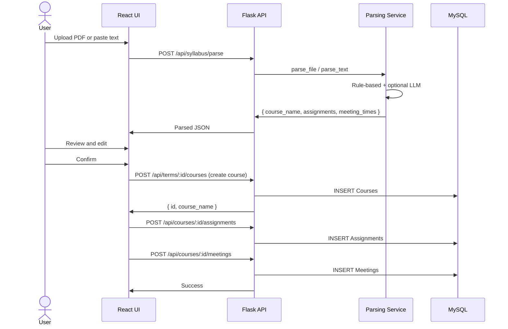
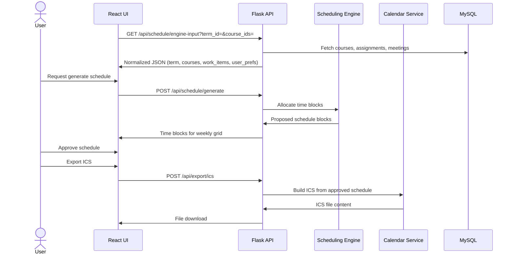

# Syllabify — Final Progress Report

**Course:** CS 422 / CS 522 — Software Methodologies I  
**Institution:** University of Oregon  
**Date:** February 2026  
**Team:** Andrew Martin, Leon Wong, Kenny Nguyen, Saint George Aufranc

---

## 1. Executive Summary

Syllabify is a web-based academic planning tool that helps university students transform course syllabi into structured, personalized study schedules. Students upload syllabi (PDF or text), review and correct extracted assignments and due dates, and generate study plans that integrate with their calendars. The system emphasizes **user control**—all extracted data is reviewed before saving, and schedule export requires explicit approval.

The project follows a client–server architecture with a React frontend (Vercel), Flask backend (Render), and MySQL database (Railway). Development uses Scrum with CI/CD (GitHub Actions). The syllabus parser is implemented (hybrid LLM + heuristics); the scheduling engine and calendar export are in progress by teammates.

---

## 2. Team Ownership and Responsibilities

| Team Member        | Primary Responsibility                         | Status |
|--------------------|------------------------------------------------|--------|
| **Kenny Nguyen**   | Syllabus parser (extraction, LLM, hybrid model) | Done   |
| **Saint George Aufranc** | Scheduling engine (heuristics, time blocks, conflict detection) | In progress |
| **Leon Wong**      | Calendar export and imports (ICS, Google Calendar) | In progress |
| **Andrew Martin**  | Frontend (UI, Dashboard, Upload, Schedule, Preferences) | In progress |

Ownership is modular: parser outputs structured JSON; scheduling engine consumes it via `GET /api/schedule/engine-input`; calendar services consume approved schedules.

---

## 3. Project Overview

### 3.1 Problem Statement

Students manage academic deadlines by manually gathering information from each course. Syllabi vary in format (PDF, Canvas pages, plain text). Students transcribe due dates into calendars and estimate workload themselves. This leads to poor time management, workload imbalance, and last-minute stress.

Research (Inside Higher Ed / College Pulse, 40% of students; Educational Data Mining, >60% submit within 24h of deadline) indicates students want a tool to combine syllabi and organize deadlines. Syllabify addresses this by parsing syllabi, allocating study time, and exporting to calendars.

### 3.2 Solution Overview

1. **Upload** — PDF or pasted text
2. **Parse** — Hybrid (rule-based + optional LLM) extraction of assignments, exams, meeting times
3. **Review & confirm** — User edits and approves extracted data
4. **Generate schedule** — Engine allocates time blocks using deadlines, workload, preferences
5. **Approve & export** — User approves schedule; export to Google Calendar or ICS download

---

## 4. Final Requirements

### 4.1 Must Have (MVP)

| ID | Requirement | Owner | Status |
|----|-------------|-------|--------|
| R1 | User login (username/password) and JWT auth | Backend team | Done |
| R2 | First-time security setup (Q&A for account recovery) | Backend team | Done |
| R3 | Syllabus upload (PDF and paste text) | Kenny | Done |
| R4 | Syllabus parsing (assignments, due dates, meeting times, types) | Kenny | Done |
| R5 | Review and edit parsed data before saving | Andrew | Done |
| R6 | Save course and assignments to database | Backend team | Done |
| R7 | Term management (create, activate, list) | Backend team | Done |
| R8 | Multi-course support per term | Backend team | Done |
| R9 | Generate study schedule from courses + assignments | Saint George | In progress |
| R10 | Display proposed schedule in weekly grid | Andrew | Placeholder |
| R11 | User approves schedule before export | Andrew | Not started |
| R12 | Export to ICS file download | Leon | In progress |
| R13 | Dashboard with courses and term selector | Andrew | Done |

### 4.2 Should Have (Post-MVP)

| ID | Requirement | Owner |
|----|-------------|-------|
| R14 | Export to Google Calendar (OAuth) | Leon |
| R15 | Preferences persistence (work hours, days) | Andrew + Backend |
| R16 | User registration (signup) | Backend |
| R17 | Email for password recovery | Backend |
| R18 | Import from existing calendar (ICS/Google) | Leon |
| R19 | Conflict detection and highlighting in schedule | Saint George + Andrew |

### 4.3 Could Have

| ID | Requirement |
|----|-------------|
| R20 | Admin interface for user management |
| R21 | Maintenance mode toggle |
| R22 | Dark mode / theme preferences |
| R23 | Per-course color coding |

### 4.4 Use Cases (Summary)

1. **User login** — Authenticate; redirect to security setup (first-time) or dashboard
2. **Security setup** — One-time Q&A for account recovery
3. **Upload and parse syllabus** — PDF or text → extracted assignments, meeting times
4. **Review and confirm** — Edit parsed data → save course and assignments
5. **Generate and approve schedule** — Select courses → engine allocates blocks → user approves
6. **Export schedule** — ICS download or Google Calendar push
7. **Administrator maintenance** — User management, maintenance mode (future)

---

## 5. MVP Definition and Current Gaps

### 5.1 MVP Scope

The MVP delivers an end-to-end flow:

1. **Login** → **Security setup** (if first-time) → **Dashboard**
2. **Create term** → **Upload syllabus** → **Parse** → **Review** → **Confirm** → Course saved
3. **Generate schedule** → **View proposed schedule** → **Approve** → **Export ICS**

### 5.2 Implemented (Ready for MVP)

- Login and JWT auth
- Security setup (Q&A)
- Syllabus upload (PDF, paste)
- Hybrid parser (rule-based + optional LLM)
- Parsed data review UI with editable assignments, meeting times, instructors
- Save course, assignments, meetings to DB
- Term CRUD and activation
- Multi-course per term
- Dashboard with term selector and course cards
- Course detail page (assignments list)
- Schedule engine input API (`GET /api/schedule/engine-input`)
- Deployment (Vercel, Render, Railway)
- CI/CD (GitHub Actions)

### 5.3 Missing for MVP

| Component | Owner | Description |
|-----------|-------|-------------|
| Scheduling engine logic | Saint George | `scheduling_service.py` is a stub. Needs: input parsing, time-block allocation, conflict detection, output of proposed blocks. |
| Schedule page real data | Andrew | `SchedulePreview` uses mock data. Must fetch from schedule API and render real blocks. |
| Schedule generation API | Saint George | `POST /api/schedule/generate` (or equivalent) that calls scheduling engine and returns blocks. |
| User approval step | Andrew | “Approve schedule” before export. |
| ICS export | Leon | `calendar_service.py` and `export.py` are stubs. Need ICS generation from approved schedule. |
| Preferences persistence | Andrew | Preferences UI exists but does not persist to backend. |
| Fix: Update existing course | Backend | When uploading from Course page, update that course instead of creating a new one (duplicate-course bug). |

### 5.4 MVP Completion Checklist

- [ ] Saint George: Implement scheduling engine (allocate blocks, conflicts)
- [ ] Saint George: Expose `POST /api/schedule/generate` (or integrate engine with existing `engine-input`)
- [ ] Andrew: Wire Schedule page to real API; replace mock blocks
- [ ] Andrew: Add “Approve schedule” step before export
- [ ] Leon: Implement ICS generation in `calendar_service.py`
- [ ] Leon: Add `POST /api/export/ics` endpoint
- [ ] Andrew: Connect “Export ICS” button to export API
- [ ] Optional: Persist Preferences to backend (or use defaults)
- [ ] Fix: Update-course flow (avoid duplicate courses on re-upload)

---

## 6. Architecture

### 6.1 High-Level System Architecture

### 6.2 Data Flow Architecture

### 6.3 Component Architecture

### 6.4 Database Entity Relationship

### 6.5 API Endpoints

### 6.6 Deployment Architecture

### 6.7 Sequence: Syllabus Upload and Save

### 6.8 Sequence: Schedule Generation and Export (Target MVP)

---

## 7. Tech Stack

| Layer | Technology |
|-------|------------|
| Frontend | React 18, Vite, Tailwind CSS |
| Backend | Python 3, Flask, Flask-CORS |
| Database | MySQL 8 (Railway) |
| Auth | JWT (HS256), bcrypt |
| Parsing | Rule-based + OpenAI GPT-4o-mini (optional) |
| Deployment | Vercel (frontend), Render (backend), Railway (DB) |
| CI/CD | GitHub Actions |
| Version control | Git, branch strategy (dev → main) |

---

## 8. Current Implementation Status

### 8.1 Backend

| Component | Status | Notes |
|-----------|--------|------|
| Auth (login, JWT, security setup) | Done | Single dev user; registration TODO |
| Syllabus parse API | Done | PDF + text; hybrid parser |
| Courses API | Done | CRUD, assignments, meetings |
| Terms API | Done | CRUD, activate |
| Schedule engine-input API | Done | Returns normalized JSON for scheduling engine |
| Scheduling service | Stub | Logic to be implemented by Saint George |
| Calendar service | Stub | ICS/Google to be implemented by Leon |
| Export API | Stub | Endpoints TODO |

### 8.2 Frontend

| Component | Status | Notes |
|-----------|--------|------|
| Login page | Done | |
| Security setup page | Done | |
| Dashboard | Done | Term selector, course cards |
| Upload flow | Done | Upload → Review → Confirm |
| SyllabusUpload | Done | File + paste |
| ParsedDataReview | Done | Editable assignments, meetings |
| Course page | Done | Assignments list, delete |
| Schedule page | Placeholder | Mock blocks |
| SchedulePreview | Placeholder | MOCK_BLOCKS |
| Preferences | UI only | Not persisted |
| Layout/Nav | Done | Dashboard, Upload, Schedule, Preferences |
| Theme toggle | Done | |

### 8.3 Parser (Kenny)

| Component | Status | Notes |
|-----------|--------|------|
| Rule-based extraction | Done | assignments, meeting_times, course metadata |
| LLM parser | Done | GPT-4o-mini; `USE_LLM_PARSER` flag |
| Hybrid flow | Done | LLM fallback or supplement |
| PDF input | Done | |
| Text input | Done | |
| Confidence scores | Done | Surfaced in UI for uncertain items |

---

## 9. Key Design Decisions

1. **User confirmation required** — No automatic schedule export; user must approve.
2. **Hybrid parser** — Rule-based + optional LLM balances cost and quality; 80–90% correct with easy correction.
3. **Ownership via Terms** — Courses belong to Terms; Terms belong to Users. Multi-user isolation without redundant FKs.
4. **Engine input abstraction** — `schedule_input_builder` produces normalized JSON; scheduling engine is decoupled from DB schema.
5. **Separation of concerns** — Parser outputs JSON; engine consumes; export consumes approved schedule.
6. **Deployment** — Prod (main) and Dev (dev branch) with separate DBs and no shared credentials.

---

## 10. Risks and Mitigations

| Risk | Mitigation |
|------|------------|
| Scheduling engine delay | Engine-input API ready; Saint George can develop against contract. |
| Calendar export complexity | ICS first (simpler); Google OAuth later. |
| Parser accuracy | Confidence scores; editable review step; hybrid model. |
| Cold start (Render free tier) | Documented; first request may take 30–60s. |

---

## 11. Next Steps

1. **Saint George:** Implement `scheduling_service.py` and wire to `POST /api/schedule/generate` (or equivalent).
2. **Andrew:** Wire Schedule page to real schedule API; add approval step.
3. **Leon:** Implement ICS in `calendar_service.py`; add `POST /api/export/ics`.
4. **Andrew:** Connect Export button to export API.
5. **Backend:** Fix update-course flow (use `courseId` when provided to avoid duplicates).
6. **Optional:** Persist Preferences; add user registration; email for password recovery.

---

## 12. References

- SRS: `docs/SRS.md`
- SDS: `docs/SDS.md`
- Data architecture: `docs/DATA_ARCHITECTURE.md`
- Scheduling engine data: `docs/SCHEDULING_ENGINE_DATA.md`
- Hybrid parser: `docs/hybrid-parser.md`
- Deployment: `docs/DEPLOYMENT.md`
